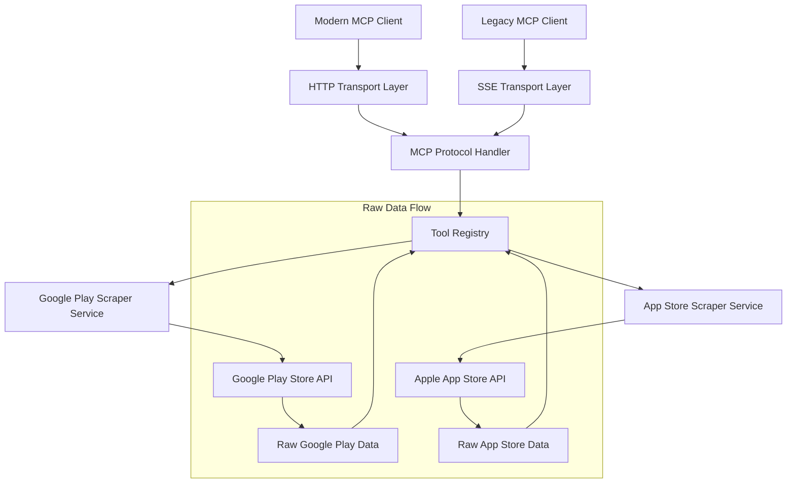

# Design Document

## Overview

The App Store MCP Server is a Node.js TypeScript application that implements the Model Context Protocol (MCP) specification to expose comprehensive app store scraping functionality over multiple transport protocols. The server integrates with `google-play-scraper` and `app-store-scraper` libraries to provide complete access to all available scraping methods from both libraries, returning raw data models to preserve all information.

The server supports both MCP Streamable HTTP transport for modern clients and Server-Sent Events (SSE) transport for legacy client compatibility, making it accessible to the widest range of MCP-compatible clients without requiring complex authentication mechanisms.

## Architecture

### High-Level Architecture



### Core Components

1. **HTTP Transport Layer**: Handles incoming HTTP requests and implements MCP Streamable HTTP transport for modern clients
2. **SSE Transport Layer**: Handles Server-Sent Events transport for legacy MCP clients not yet compatible with http-streamable
3. **MCP Protocol Handler**: Processes MCP messages, handles tool discovery, and manages tool execution across both transport types
4. **Tool Registry**: Manages registration and discovery of all available scraping tools from both libraries
5. **Scraper Services**: Direct wrapper services around the third-party scraping libraries that preserve raw data models
6. **Error Handler**: Centralized error handling and response formatting

### Technology Stack

- **Runtime**: Node.js (v18+)
- **Language**: TypeScript
- **HTTP Framework**: Express.js or Fastify for HTTP server
- **MCP Implementation**: Custom implementation following MCP specifications
- **Scraping Libraries**: 
  - `google-play-scraper` for Google Play Store
  - `app-store-scraper` for Apple App Store
- **Containerization**: Docker

## Components and Interfaces

### MCP Server Interface

```typescript
interface MCPServer {
  start(port: number): Promise<void>;
  stop(): Promise<void>;
  registerTool(tool: MCPTool): void;
  handleRequest(request: MCPRequest): Promise<MCPResponse>;
}
```

### Tool Interface

```typescript
interface MCPTool {
  name: string;
  description: string;
  inputSchema: JSONSchema;
  execute(params: any): Promise<any>;
}
```

### Transport Handler Interfaces

```typescript
interface HTTPTransportHandler {
  handleStreamableRequest(req: Request, res: Response): Promise<void>;
  processMessage(message: MCPMessage): Promise<MCPMessage>;
}

interface SSETransportHandler {
  handleSSEConnection(req: Request, res: Response): void;
  sendMessage(message: MCPMessage): void;
  closeConnection(): void;
}
```

### Scraper Service Interfaces

```typescript
interface GooglePlayScraperService {
  // Core methods
  app(params: any): Promise<any>;
  list(params: any): Promise<any>;
  search(params: any): Promise<any>;
  developer(params: any): Promise<any>;
  suggest(params: any): Promise<any>;
  reviews(params: any): Promise<any>;
  similar(params: any): Promise<any>;
  permissions(params: any): Promise<any>;
  datasafety(params: any): Promise<any>;
  categories(): Promise<any>;
}

interface AppStoreScraperService {
  // Core methods
  app(params: any): Promise<any>;
  list(params: any): Promise<any>;
  search(params: any): Promise<any>;
  developer(params: any): Promise<any>;
  privacy(params: any): Promise<any>;
  suggest(params: any): Promise<any>;
  similar(params: any): Promise<any>;
  reviews(params: any): Promise<any>;
  ratings(params: any): Promise<any>;
}
```

## Data Models

### Core MCP Types

```typescript
interface MCPRequest {
  jsonrpc: "2.0";
  id: string | number;
  method: string;
  params?: any;
}

interface MCPResponse {
  jsonrpc: "2.0";
  id: string | number;
  result?: any;
  error?: MCPError;
}

interface MCPError {
  code: number;
  message: string;
  data?: any;
}
```

### Raw Data Model Strategy

Instead of transforming data into common models, the server will return raw responses from the underlying scraping libraries to preserve all available information:

```typescript
// Raw data is returned as-is from the libraries
type GooglePlayAppData = any; // Complete response from google-play-scraper.app()
type GooglePlayListData = any; // Complete response from google-play-scraper.list()
type GooglePlaySearchData = any; // Complete response from google-play-scraper.search()
type GooglePlayReviewsData = any; // Complete response from google-play-scraper.reviews()

type AppStoreAppData = any; // Complete response from app-store-scraper.app()
type AppStoreListData = any; // Complete response from app-store-scraper.list()
type AppStoreSearchData = any; // Complete response from app-store-scraper.search()
type AppStoreReviewsData = any; // Complete response from app-store-scraper.reviews()
```

### Comprehensive Tool Definitions

The server will expose MCP tools for all available methods from both scraping libraries:

#### Google Play Store Tools (10 tools)
1. **google-play-app**: Get detailed app information using google-play-scraper.app()
2. **google-play-list**: Get app lists from collections using google-play-scraper.list()
3. **google-play-search**: Search for apps using google-play-scraper.search()
4. **google-play-developer**: Get apps by developer using google-play-scraper.developer()
5. **google-play-suggest**: Get search suggestions using google-play-scraper.suggest()
6. **google-play-reviews**: Get app reviews using google-play-scraper.reviews()
7. **google-play-similar**: Get similar apps using google-play-scraper.similar()
8. **google-play-permissions**: Get app permissions using google-play-scraper.permissions()
9. **google-play-datasafety**: Get data safety info using google-play-scraper.datasafety()
10. **google-play-categories**: Get available categories using google-play-scraper.categories()

#### Apple App Store Tools (9 tools)
1. **app-store-app**: Get detailed app information using app-store-scraper.app()
2. **app-store-list**: Get app lists from collections using app-store-scraper.list()
3. **app-store-search**: Search for apps using app-store-scraper.search()
4. **app-store-developer**: Get apps by developer using app-store-scraper.developer()
5. **app-store-privacy**: Get privacy details using app-store-scraper.privacy()
6. **app-store-suggest**: Get search suggestions using app-store-scraper.suggest()
7. **app-store-similar**: Get similar apps using app-store-scraper.similar()
8. **app-store-reviews**: Get app reviews using app-store-scraper.reviews()
9. **app-store-ratings**: Get app ratings using app-store-scraper.ratings()

### Localization and Regional Support

The MCP tools support localization and regional customization through optional parameters:

#### Language Support (Google Play Store)
- **Parameter**: `lang` (optional, string)
- **Format**: ISO 639-1 two-letter lowercase language codes (e.g., 'en', 'fr', 'es')
- **Default**: 'en' (English)
- **Supported Tools**: google-play-app-details, google-play-search, google-play-list, google-play-developer, google-play-suggest, google-play-similar, google-play-permissions, google-play-datasafety, google-play-app-reviews

#### Country Support (Both Stores)
- **Parameter**: `country` (optional, string)
- **Format**: ISO 3166-1 alpha-2 two-letter lowercase country codes (e.g., 'us', 'ca', 'gb')
- **Default**: 'us' (United States)
- **Google Play Tools**: All tools that support language also support country
- **App Store Tools**: app-store-app-details, app-store-search, app-store-list, app-store-developer, app-store-suggest, app-store-similar, app-store-ratings, app-store-app-reviews

#### Parameter Validation
- Language and country codes are validated using regex patterns
- Invalid codes result in descriptive validation error messages
- Parameters are optional and backward compatible with existing implementations

#### Usage Examples
```typescript
// Google Play with French language and Canadian region
{
  appId: 'com.example.app',
  lang: 'fr',
  country: 'ca'
}

// App Store with Canadian region
{
  appId: '123456789',
  country: 'ca'
}
```

## Error Handling

### Error Categories

1. **Validation Errors** (400): Invalid input parameters or malformed requests
2. **Not Found Errors** (404): App or resource not found in app stores
3. **Rate Limiting Errors** (429): Too many requests to app store APIs
4. **Network Errors** (502): Connectivity issues with app store services
5. **Internal Errors** (500): Server-side processing errors

### Error Response Format

```typescript
interface ErrorResponse {
  jsonrpc: "2.0";
  id: string | number;
  error: {
    code: number;
    message: string;
    data?: {
      type: string;
      details: any;
    };
  };
}
```

### Error Handling Strategy

- Input validation using JSON Schema validation
- Graceful degradation when app store APIs are unavailable
- Retry logic with exponential backoff for transient failures
- Structured error logging for debugging
- Client-friendly error messages without exposing internal details

## Testing Strategy

### Unit Testing

- **Tool Implementation Tests**: Verify each MCP tool executes correctly with valid inputs
- **Scraper Service Tests**: Mock external API calls and test data transformation
- **Protocol Handler Tests**: Test MCP message processing and response formatting
- **Validation Tests**: Ensure input validation works correctly for all tools

### Integration Testing

- **End-to-End MCP Flow**: Test complete request/response cycle through HTTP transport
- **External API Integration**: Test actual calls to scraping libraries (with rate limiting)
- **Error Handling Integration**: Verify error propagation through all layers

### Testing Tools

- **Jest**: Primary testing framework
- **Supertest**: HTTP endpoint testing
- **MSW (Mock Service Worker)**: Mock external API responses
- **Docker Compose**: Integration testing environment

### Test Data Strategy

- Use real app IDs for integration tests (with rate limiting considerations)
- Mock responses for unit tests to ensure consistent test results
- Separate test suites for different app stores to isolate failures

## Deployment Architecture

### Docker Configuration

- **Base Image**: Node.js Alpine for minimal footprint
- **Multi-stage Build**: Separate build and runtime stages
- **Health Checks**: HTTP endpoint for container health monitoring
- **Environment Variables**: Configurable port, logging level, and rate limiting

### Configuration Management

```typescript
interface ServerConfig {
  port: number;
  logLevel: string;
  rateLimiting: {
    windowMs: number;
    maxRequests: number;
  };
  scraping: {
    timeout: number;
    retries: number;
  };
}
```

### Monitoring and Observability

- Structured logging with request correlation IDs
- Metrics collection for tool usage and performance
- Health check endpoint for container orchestration
- Error rate monitoring and alerting capabilities