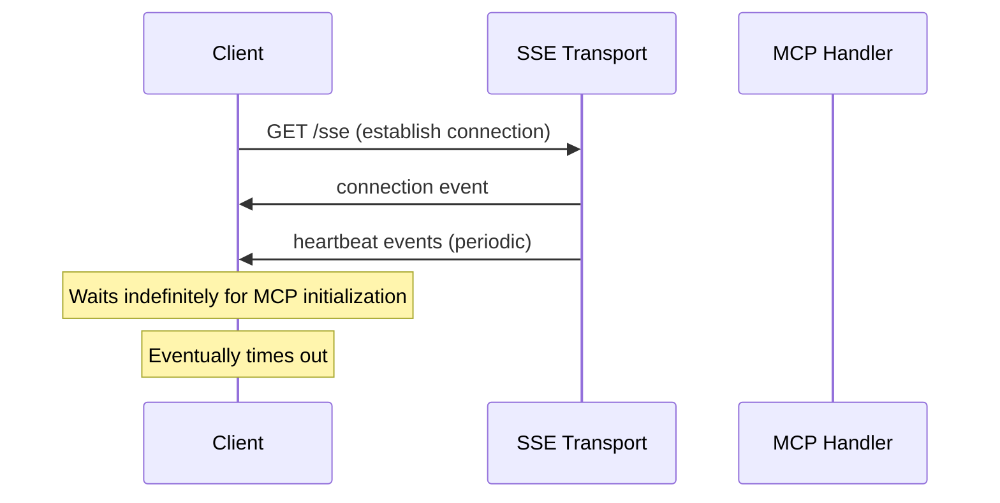
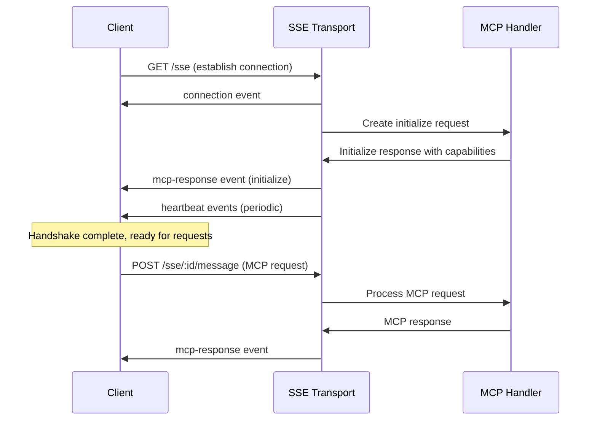

# Design Document

## Overview

The SSE connection timeout issue stems from the fact that MCP clients expect a proper protocol handshake when connecting via SSE transport, but the current implementation only sends connection establishment events and heartbeats. The client waits indefinitely for MCP initialization messages that never arrive, causing the connection to timeout.

The solution involves modifying the SSE transport to automatically send MCP initialization messages when a connection is established, mimicking the behavior that clients would expect from a standard MCP server handshake.

## Architecture

### Current SSE Flow (Problematic)


### Proposed SSE Flow (Fixed)


## Components and Interfaces

### Modified SSE Transport Handler

The `SSETransportHandler` class needs to be enhanced to automatically initiate the MCP handshake:

```typescript
interface SSETransportHandler {
  // Existing methods
  handleSSEConnection(req: Request, res: Response): void;
  handleMCPMessage(connectionId: string, message: any): Promise<void>;
  
  // New methods for initialization
  sendInitializationMessage(connectionId: string): Promise<void>;
  createInitializeRequest(): MCPRequest;
}
```

### MCP Protocol Integration

The SSE transport needs to integrate more closely with the MCP protocol handler:

```typescript
interface MCPInitializationFlow {
  // Create a synthetic initialize request
  createInitializeRequest(): MCPRequest;
  
  // Process the initialize request and get response
  processInitializeRequest(request: MCPRequest): Promise<MCPResponse>;
  
  // Send the initialize response via SSE
  sendInitializeResponse(connectionId: string, response: MCPResponse): void;
}
```

## Data Models

### MCP Initialize Request
```typescript
interface MCPInitializeRequest extends MCPRequest {
  method: 'initialize';
  params: {
    protocolVersion: string;
    capabilities: {
      roots?: {
        listChanged?: boolean;
      };
      sampling?: {};
    };
    clientInfo: {
      name: string;
      version: string;
    };
  };
}
```

### MCP Initialize Response
```typescript
interface MCPInitializeResponse extends MCPResponse {
  result: {
    protocolVersion: string;
    capabilities: {
      tools: {};
      logging: {};
    };
    serverInfo: {
      name: string;
      version: string;
    };
  };
}
```

## Error Handling

### Initialization Error Scenarios

1. **MCP Handler Unavailable**: If the MCP handler is not configured when SSE connection is established
2. **Initialize Request Processing Failure**: If the synthetic initialize request fails to process
3. **Response Sending Failure**: If the initialize response cannot be sent via SSE

### Error Response Strategy

```typescript
interface InitializationErrorResponse {
  jsonrpc: '2.0';
  id: string | number;
  error: {
    code: number;
    message: string;
    data?: {
      type: 'initialization_error';
      phase: 'request_creation' | 'request_processing' | 'response_sending';
      details: any;
    };
  };
}
```

## Testing Strategy

### Unit Testing

1. **SSE Initialization Tests**: Verify that initialize messages are sent automatically on connection
2. **MCP Request Creation Tests**: Test synthetic initialize request creation
3. **Response Handling Tests**: Verify initialize responses are properly formatted and sent
4. **Error Handling Tests**: Test initialization failure scenarios

### Integration Testing

1. **End-to-End SSE Flow**: Test complete SSE connection and initialization flow
2. **MCP Client Compatibility**: Test with actual MCP client libraries (like Trae AI)
3. **Timeout Prevention**: Verify that clients no longer timeout during connection
4. **Tool Discovery**: Test that clients can discover and call tools after initialization

### Test Implementation

```typescript
describe('SSE Initialization Fix', () => {
  it('should send initialize response immediately after connection', async () => {
    // Test that initialize message is sent automatically
  });
  
  it('should allow clients to discover tools after initialization', async () => {
    // Test tool discovery works after handshake
  });
  
  it('should handle initialization errors gracefully', async () => {
    // Test error scenarios during initialization
  });
});
```

## Implementation Details

### SSE Transport Modifications

1. **Auto-initialization**: When `handleSSEConnection` is called, automatically create and process an initialize request
2. **Synthetic Request Creation**: Create a synthetic MCP initialize request with appropriate parameters
3. **Response Routing**: Send the initialize response as an `mcp-response` event immediately after connection
4. **Logging Enhancement**: Add detailed logging for the initialization process

### MCP Handler Integration

1. **Initialize Method**: Ensure the MCP handler's `handleInitialize` method works correctly for synthetic requests
2. **Capabilities Response**: Verify that server capabilities are properly returned in initialize responses
3. **Protocol Version**: Ensure protocol version compatibility is handled correctly

### Connection State Management

1. **Initialization Status**: Track whether each SSE connection has completed initialization
2. **Request Queuing**: Optionally queue incoming requests until initialization is complete
3. **Connection Cleanup**: Ensure initialization state is cleaned up when connections close

## Deployment Considerations

### Backward Compatibility

- The fix should not break existing HTTP transport functionality
- SSE transport should remain optional and configurable
- Existing SSE clients should continue to work (if any)

### Configuration Options

```typescript
interface SSETransportConfig {
  // Existing options
  heartbeatInterval?: number;
  connectionTimeout?: number;
  maxConnections?: number;
  enableLogging?: boolean;
  
  // New options
  autoInitialize?: boolean; // Default: true
  initializationTimeout?: number; // Default: 5000ms
}
```

### Monitoring and Observability

- Add metrics for SSE initialization success/failure rates
- Log initialization timing for performance monitoring
- Track client connection duration after successful initialization
- Monitor for any remaining timeout issues

## Security Considerations

### Input Validation

- Validate that synthetic initialize requests are properly formatted
- Ensure initialization responses don't expose sensitive server information
- Validate connection state before processing subsequent requests

### Rate Limiting

- Apply rate limiting to SSE connection establishment
- Prevent abuse of the initialization process
- Monitor for unusual connection patterns

## Performance Impact

### Minimal Overhead

- Initialization happens once per connection
- Synthetic request processing reuses existing MCP handler logic
- No significant impact on ongoing message processing

### Connection Efficiency

- Faster client connection establishment
- Reduced client-side timeout handling
- Improved overall user experience with SSE transport